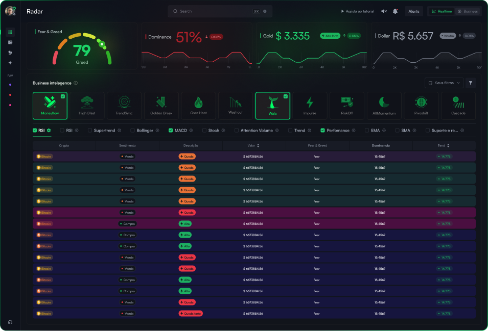
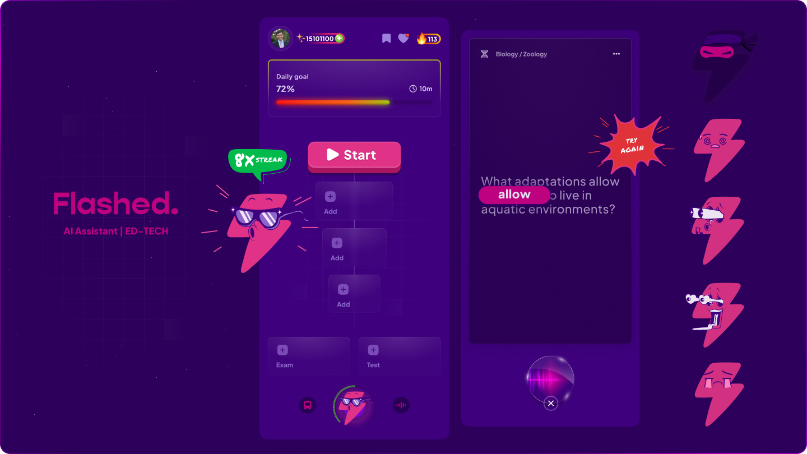
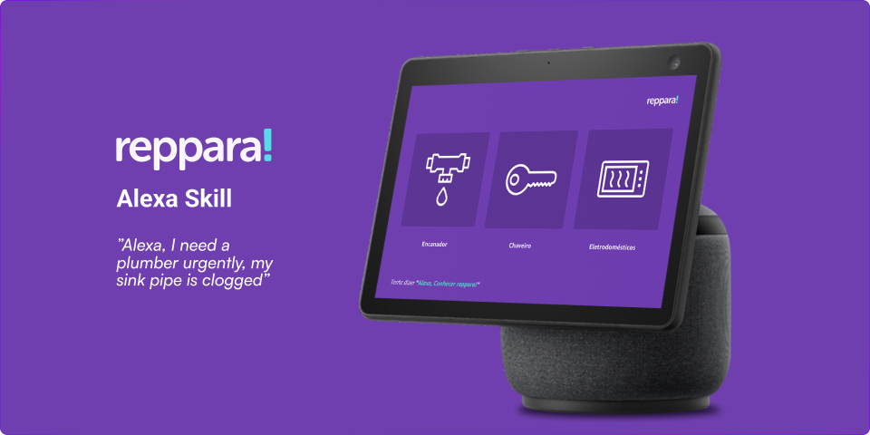
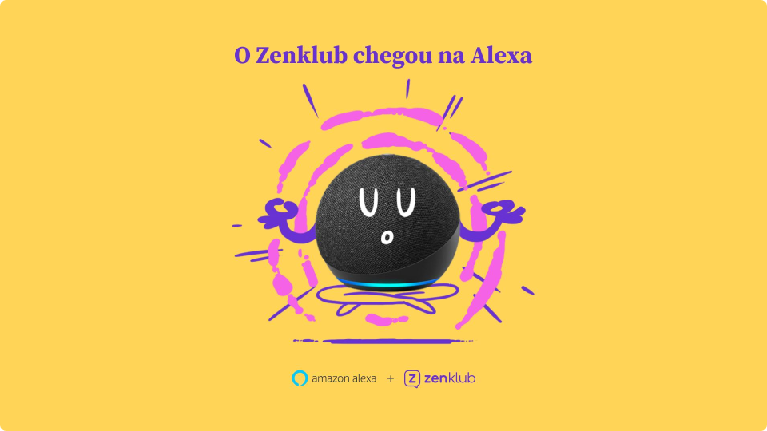
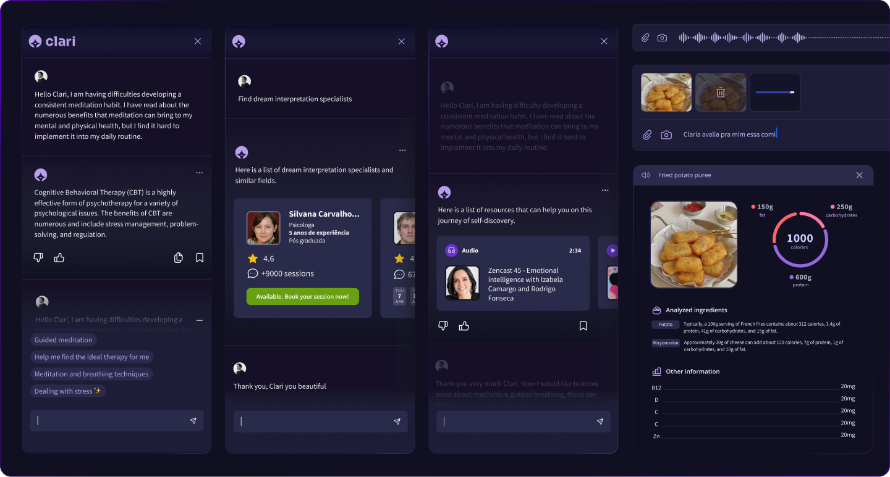
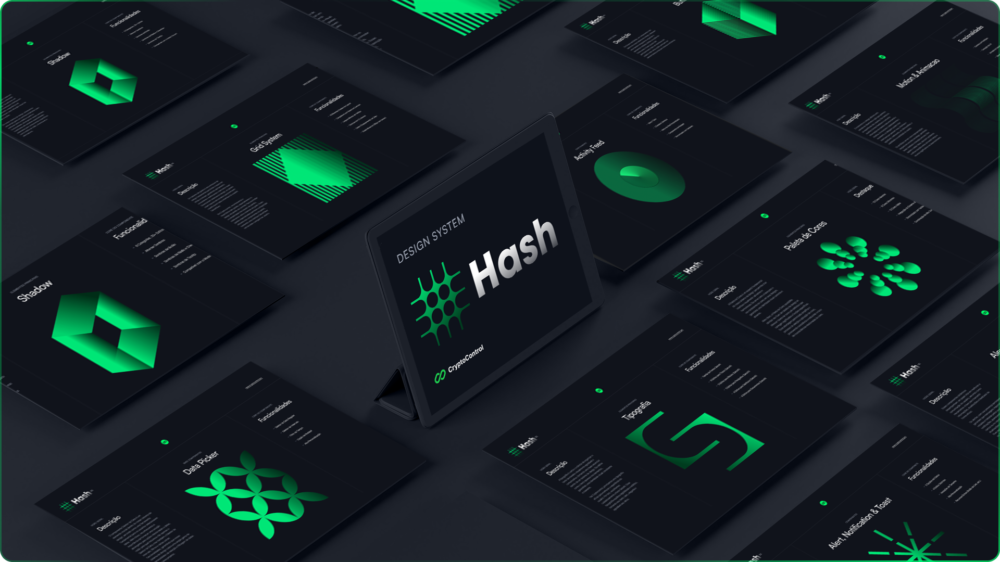

# I transform `complex problems` into `elegant products`

**`Currently`** Building something new in stealth mode (AI + Mental Health)

**`Previously`** Led product design at Brazil's largest digital health tech platforms [(Zenklub/Conexa)](https://zenklub.com.br/busca/)

**`Mission`** Technology should be a silent partner in human greatness

**`Philosophy`** The best interface is no interface
# Make it simple, but `significant`

Research Interests

> `Architecture Search & Surgery` Basic NAS (learning, real in baby steps), mergekit, quantization, structural pruning

> `Parameter-Efficient Fine-Tuning` LoRA, QLoRA, adapter fusion techniques

> `Speech Technologies` Speech-to-Speech (S2S), Speech-to-Text (STT), prosody transfer

> `Fractal & Recursive Architectures` Self-similar neural structures, cascade models

> `Neurosemantic Computing` Brain-inspired language processing architectures & semantic parsing

# Recent Projects

## [CryptoControl](https://cryptocontrol.pro)
Led product development for V2 of Latin America's largest cryptocurrency portfolio management platform. Took over from a weak MVP and managed product design and engineering teams to deliver AI-powered analytics and trading tools for professional investors. Built comprehensive platform processing millions in daily transactions.

[](https://cryptocontrol.pro)

## [Flashed - AI Learning Platform](https://apps.apple.com/br/app/flashed-revis%C3%A3o-di%C3%A1ria/id6460138270)
Led as CPO and product design specialist for AI-powered study assistant that adapts to each student's learning style. Built the complete design system and UI for all interfaces. Platform delivers personalized content in the format that works best for each user - video, images, diagrams, or interactive questions. Launched MVP that reached #7 in App Store Education category within one week. 

[](https://apps.apple.com/br/app/flashed-revis%C3%A3o-di%C3%A1ria/id6460138270)

## [Alexa Skill - Porto Seguro Home Services](https://www.portoseguro.com.br)
Led the entire Voice UX tribe including Voice User Experience Designers, UX Writers, developers, and Product Managers. Built voice-activated home repair service for Latin America's largest insurer. Users can request plumbing, electrical, and maintenance services through natural conversation. First fully-integrated insurance voice skill with Amazon certification.

[](https://www.portoseguro.com.br)

## [Alexa Skill - Zenklub Mental Health](https://www.amazon.com.br/Zenklub-bem-estar-todo-dia/dp/B0BBP49XM3/ref=sr_1_1?__mk_pt_BR=%C3%85M%C3%85%C5%BD%C3%95%C3%91&crid=3EYRCCMU5B4D9&dib=eyJ2IjoiMSJ9.jTpn4VfysNfWRrrZ-vQB7g._1kFgso-VGPd40bjIp91PemlwE7hRQtIZifbznFMDC0&dib_tag=se&keywords=zenklub&qid=1753828832&s=alexa-skills&sprefix=zenklub%2Calexa-skills%2C169&sr=1-1)
Created the concept and led the entire team developing voice interface for mental health support. Built guided meditations, anxiety management tools, and voice-activated appointment scheduling. Connected users to licensed therapists through natural conversation flows.

[](https://www.amazon.com.br/Zenklub-bem-estar-todo-dia/dp/B0BBP49XM3/ref=sr_1_1?__mk_pt_BR=%C3%85M%C3%85%C5%BD%C3%95%C3%91&crid=3EYRCCMU5B4D9&dib=eyJ2IjoiMSJ9.jTpn4VfysNfWRrrZ-vQB7g._1kFgso-VGPd40bjIp91PemlwE7hRQtIZifbznFMDC0&dib_tag=se&keywords=zenklub&qid=1753828832&s=alexa-skills&sprefix=zenklub%2Calexa-skills%2C169&sr=1-1)

## [Clari AI - Zenklub Assistant](https://zenklub.com.br/site/para-voce)
Started and led this AI project from zero. Built MVP for matching patients with therapists using behavioral profiling. Added nutritional counseling with photo analysis, emotional support, and cognitive behavioral therapy (CBT) techniques. Identifies severe cases for immediate care. Used by 23% of platform users as primary entry point. Integrated across all platform services.

[](https://zenklub.com.br/site/para-voce)

## [Hash - Design System](https://www.figma.com/design/USx5XDTlpPsabJSZoyWLYV/Hash-Design-System---Cryptocontrol-V1?node-id=553-14956&t=iE4gYUPCSrXTR94X-1)
As Product Design Specialist, built complete design system for cryptocurrency platform with 70+ components. Implemented WCAG 2.1 AA accessibility standards throughout. Led front-end team implementation ensuring visual consistency and seamless handoff during development. Created comprehensive documentation in Figma and component library in Next.js.

[](https://www.figma.com/design/USx5XDTlpPsabJSZoyWLYV/Hash-Design-System---Cryptocontrol-V1?node-id=553-14956&t=iE4gYUPCSrXTR94X-1)

# Current Hyperfocus

**Experimenting:** `Svelte` + `Tauri` for blazing fast desktop apps `(sorry React, it's not you, it's Svelte)`

**Reading:** Papers on **`mixture of experts (MoE)`** architectures

**Building:** Local-first AI tools that **`respect privacy`**

**Learning:** FlashAttention v2, **`speculative decoding`**, continuous batching, **`neural semantic parsing`**

# Skills
```
Products Strategy (PRO Mode)
```
Team leadership, interaction design, user research, PLG (product led growth), VUI, motion UI, design systems.
```
AI & Machine Learning 
```

LLM deployment, fine-tuning, embeddings, vector databases, neuro semantic, multimodal AI, voice interfaces (STT/S2S), model optimization.


# Tech Stack

> *I'm 2e (autistic)*  
> *My brain doesn't do "or" - only "and"*
> *That's why I can go from Figma to Three.js without blinking (:*  

```javascript
// 21+ years in tech. These are the tools that stuck with me:
const stack = {
  ai:             ['Autotrain', 'Ollama', 'PyTorch', 'Tensorflow', 'HuggingFace', 'LangChain'],
  frontend:       ['TypeScript', 'React', 'Next.js', 'Svelte', 'Three.js', 'Tailwind', 'WebGL','GLSL'],
  backend:        ['Python', 'Rust', 'FastAPI', 'PostgreSQL', 'Redis'],
  vectors:        ['Chroma', 'Pinecone', 'pgvector'],
  infrastructure: ['Docker', 'Google Cloud', 'AWS'],
  realtime:       ['WebRTC', 'WebSockets'],
  hardware:       ['Arduino', 'Raspberry Pi'],
  voice:          ['Whisper', 'Coqui TTS', 'Alexa Skills'],
  philosophy:     ['Simplicity', 'Empathy', 'Craft']
};
```

## "The future belongs to those who see possibilities where others see limitations."

[](https://www.linkedin.com/in/brennercruvinel/)
[](https://www.instagram.com/brennercruvinel/)
[](https://x.com/brennercruvinel)

